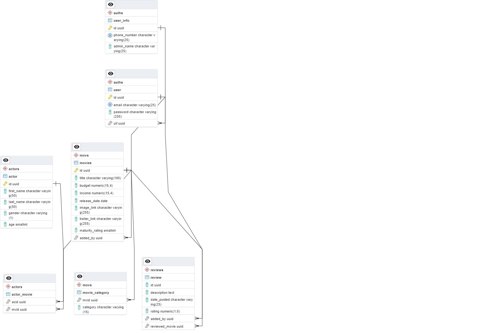

### Projects

#####  DSS1-UI-V1
 * User interface that will connect to the spring boot projects

##### DSS2-REST-BE-V1
 * Monolith version of the capstone project
 * Port: 9000

#### Micro services

* ##### DSS3-MS-LOGIN-V1
  * Handles the registration and login service
  * Port: 9005
* ##### DSS5-MS-ACTOR-V1
  * Handles the functionalities for actor(Add, Edit, Delete, Update, View)
  * * Port: 9006
* ##### DSS4-MS-MOVIE-V1
  * Handles the functionalities for movies(Add, Edit, Delete, Update, View)
  * * Port: 9007
* ##### DSS6-MS-REVIEW-V1
  * Handles the functionalities for review(Add, Edit, Delete, Update, View)
  * * Port: 9008
* ##### DSS7-EUREKA-V1
  * Handles the service registry.
  * * Port: 8761

#### Other project files
database sqls: DSS1-UI-V1\artifact

#### ERD
